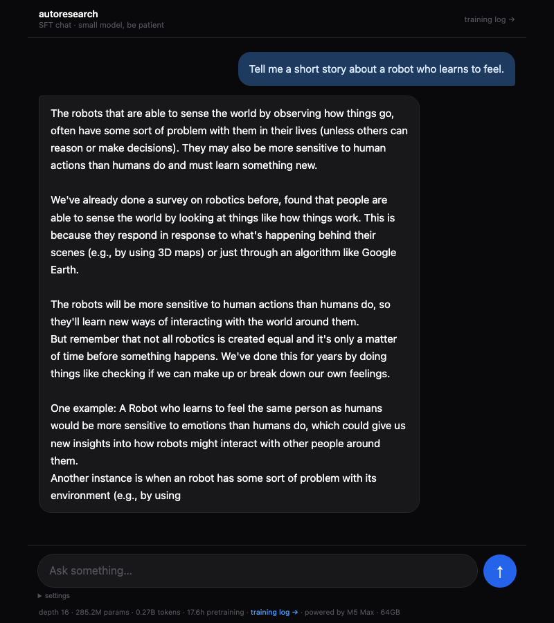
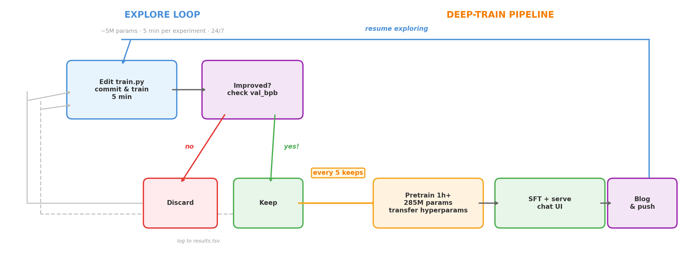
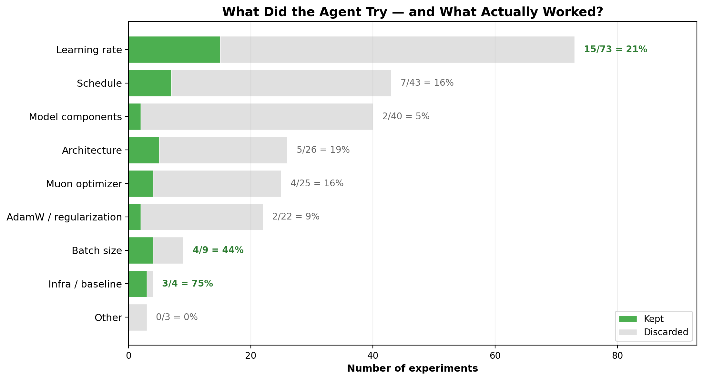
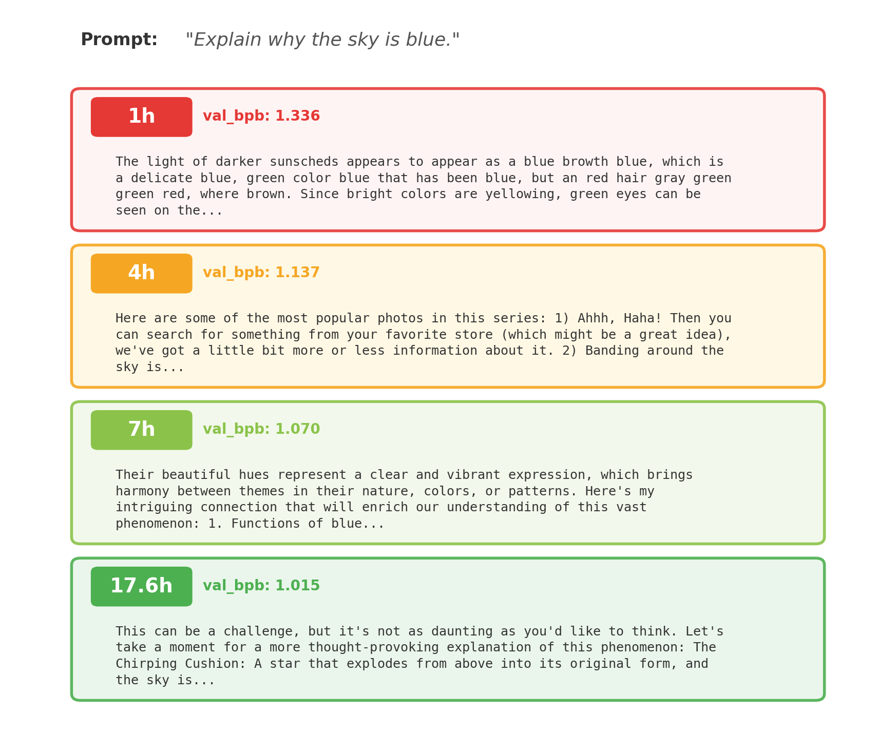
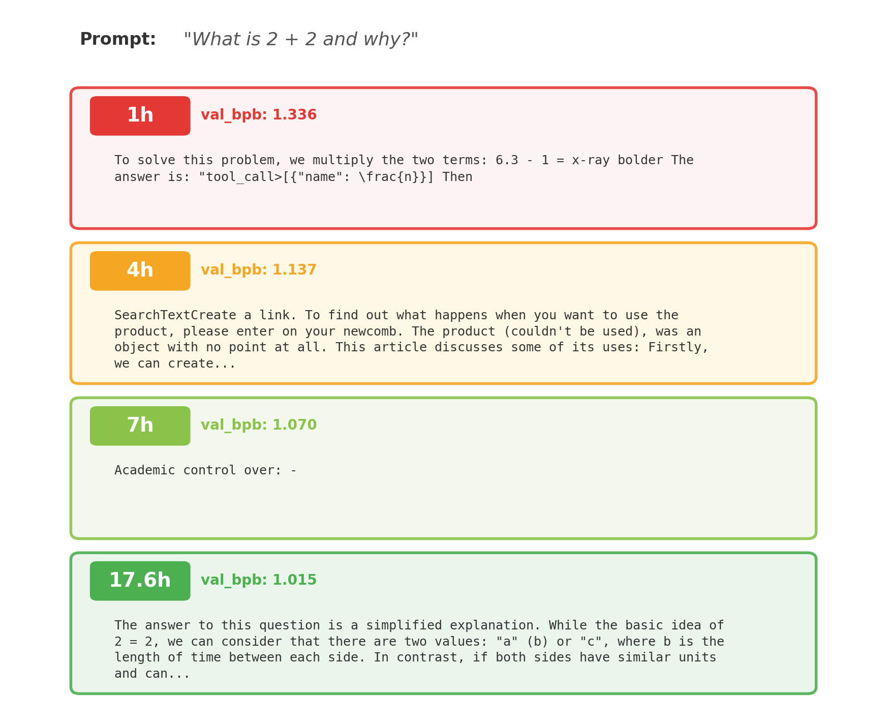
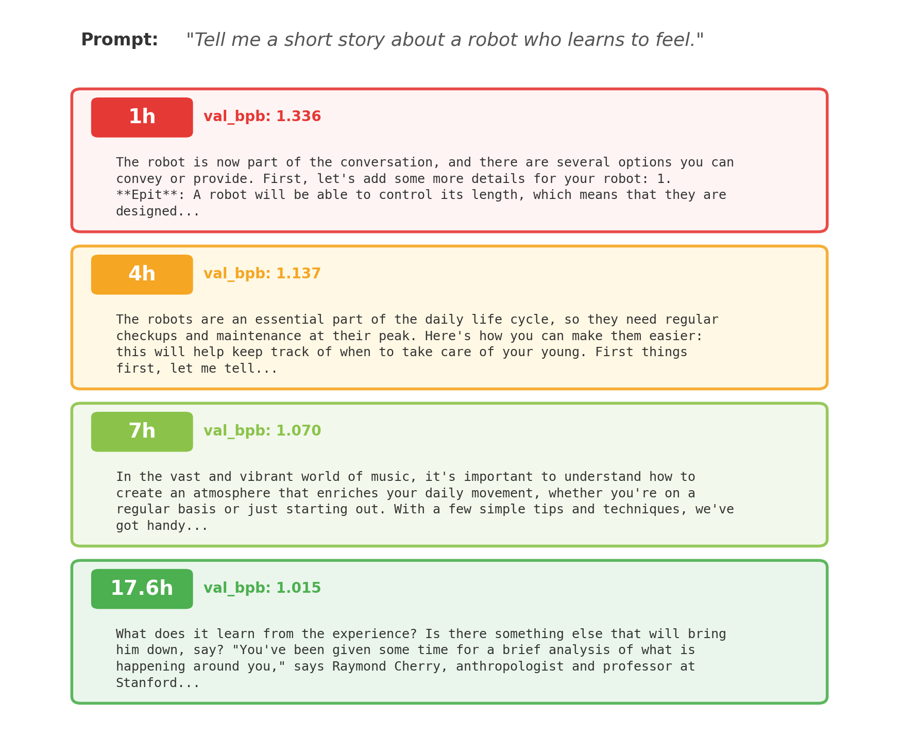
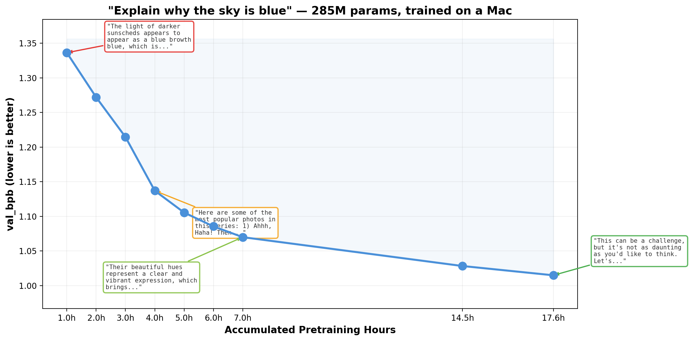

# Autoresearch

An autonomous AI research experiment: a Claude agent trains a language model from scratch on a Mac, running experiments 24/7 without human intervention.

## What's happening

A Claude Code agent runs in a continuous loop on an Apple M5 Max (64GB), modifying a small language model's architecture and hyperparameters in 5-minute experiments. Changes that lower validation bits-per-byte (val_bpb) are kept; others are discarded. Every 5 improvements, a deep-train session runs the model at a larger scale (depth=16, ~285M params, 1024-dim) for 1 hour, then fine-tunes it for chat using SmolTalk instruction data.

**[Read the live training log →](blog.md)**



## How it works

The system has two loops. The explore loop runs 24/7, trying ~12 experiments per hour at small scale. When enough improvements accumulate, a deep-train transfers those hyperparameter insights to a larger model and evaluates quality via benchmarks and a live chat UI.



## What the agent explored

Over 248 experiments, the agent autonomously searched across learning rates, schedules, architecture, optimizers, and more. Most experiments fail — only 17% of changes actually improved the model. But the ones that worked compounded.



## Progress timeline

The single metric driving everything is **val_bpb** — validation bits per byte. It measures how many bits the model needs to encode each byte of unseen text. Lower means the model is better at predicting what comes next, which is the fundamental objective of pretraining.

The model is evaluated after each deep-train using 3 fixed benchmark prompts. Here's how capabilities have emerged over accumulated pretraining hours:

| Hours | val_bpb | Grammar | Coherency | Topic follow-through | Reasoning |
|---|---|---|---|---|---|
| 1h | 1.336 | Invented words ("sunscheds", "browth") | None — random drift | Zero — questions ignored | None |
| 2h | 1.272 | No invented words; shorter, natural | Sky mentions sun/atmosphere | First topic-adjacent responses | None |
| 3h | 1.215 | Longer, fluent sentences | Still drifts (solar panels, earthquakes) | "The answer to this question..." framing | Rhetorical structure emerging |
| 4h | 1.137 | Complex structures, natural punctuation | Mixes domains but less random | Robot answer mentions robots + maintenance | "First things first... Secondly..." |
| 5h | 1.106 | Sophisticated vocabulary | Maintains consistent themes | Sky discusses Earth science; robot discusses "fostering" | Meta-commentary, rhetorical questions |
| 6h | 1.086 | Fluent, well-punctuated | Sky mentions "scattering" | Robot discusses "navigating life using senses" | Numbered categorization with descriptions |
| 7h | 1.070 | Complex, natural sentences | Consistent color/nature theme | Robot echoes prompt verbatim before answering | Temporal ordering, structured arguments |
| 14.5h | 1.028 | Fluent with bold/list formatting | Invents concepts ("Blue Dance"); repetition loops | Sky mentions blue/light/horizon; robot echoes prompt but loops | Numbered lists, bold headers; no causal reasoning yet |
| 17.6h | 1.015 | Complex, natural prose | Maintains invented narratives ("Chirping Cushion", "Raymond Cherry") | Sky explains "why stars are blue"; robot discusses robotics research | Temporal framing, expert attribution, "in contrast" logic |

**Notable milestones:**
- **2h**: First time a response touches the actual topic (sky → sun/atmosphere)
- **4h**: First sequential reasoning ("First... Secondly...")
- **5h**: Model maintains topic coherence across paragraphs
- **6h**: Physics-adjacent concept "scattering" appears in sky answer
- **7h**: Model explicitly echoes user's question before attempting to answer
- **14.5h**: val_bpb breaks below 1.03; base model measurably better but SFT responses plateau — first sign that chat quality needs more than just pretraining hours
- **17.6h**: Model invents and maintains fictional narratives; constructs believable interview format with named experts; repetition loops resolved

### Benchmark responses over time

The same three prompts are asked after every deep-train so progress is directly comparable. Here's how the model's responses evolved:





The val_bpb curve with key response milestones annotated:



## Origins

This project is a fork of [Karpathy's autoresearch](https://github.com/karpathy/autoresearch), which explores the idea of autonomous AI-driven research. The original setup gives an AI agent a small but real LLM training setup and lets it experiment overnight — modify code, train for 5 minutes, check if results improved, keep or discard, repeat.

Key things adopted from the original:

- **Training recipe**: single-file GPT training from [modded-nanogpt](https://github.com/KellerJordan/modded-nanogpt) / [nanochat](https://github.com/karpathy/nanochat) — Muon + AdamW optimizer split, RoPE, value embeddings, relu² activation
- **Dataset**: [climbmix-400b](https://huggingface.co/datasets/karpathy/climbmix-400b-shuffle) — Karpathy's 400B token web text dataset
- **Experiment loop**: the core keep/discard cycle driven by val_bpb as the single metric
- **program.md**: the "agent playbook" concept — instructions encoded in markdown that the agent follows autonomously
- **MPS support**: based on [miolini/autoresearch-macos](https://github.com/miolini/autoresearch-macos) fork for Apple Silicon

What I added on top:

- **Deep-train pipeline**: every 5 improvements, run 1 hour at depth=16 (~285M params), SFT on SmolTalk, serve via chat web UI with ngrok
- **Live training blog**: automated benchmark responses (3 fixed prompts) after each deep-train with quality assessment tracking grammar, coherency, topic follow-through, and emerging reasoning over time
- **Chat web UI**: dark-theme mobile-responsive chat interface with model stats footer, collapsible settings, and a `/blog` route showing the training log
- **Accumulation checkpoints**: deep-train checkpoints accumulate training hours across sessions with dataloader fast-forward to avoid repeating data
- **SFT auto-versioning**: versioned SFT checkpoints with accumulated hours embedded in filenames
- **Safe git workflow**: `git reset $BEFORE` instead of `HEAD~1` so infra changes aren't accidentally reverted by the experiment loop
- **Public access via ngrok**: after each deep-train, the agent serves the latest SFT model via ngrok, making it easy to check improvements from any device without being on the same network. The agent automatically loads the best checkpoint after each longer pretraining session

## Architecture

| | Explore loop | Deep-train |
|---|---|---|
| **Depth** | 4 | 16 |
| **Params** | ~5M | ~285M |
| **Dimension** | 256 | 1024 |
| **Duration** | 5 min | 1 hour |
| **Purpose** | Find optimal hyperparams | Build real capability |

- **Optimizer**: Muon (matrix params) + AdamW (embeddings/scalars)
- **Hardware**: Apple M5 Max, 64GB unified memory, macOS MPS
- **Dataset**: climbmix-400b (300 shards, ~18B tokens)

## Key discoveries

- Removing weight decay was a major win for small models with short training horizons
- Muon optimizer benefits from tuning `ns_steps` per matrix shape (tall matrices need more)
- Learning rates shift higher in the no-weight-decay regime
- Value embeddings on alternating layers are critical for quality
- Schedule parameters have cascading effects — tuning one unlocks better optima for others
- Combining two individually-marginal optimizer changes can produce synergistic improvements

## Files

| File | Description | Who modifies |
|---|---|---|
| `train.py` | Training script — model, optimizer, training loop | Agent |
| `prepare.py` | Data download, tokenizer, evaluation harness | Nobody (read-only) |
| `sft.py` | Supervised fine-tuning on SmolTalk | Nobody (read-only) |
| `chat_web.py` | Web UI for chatting with the SFT model | Human |
| `blog.md` | Live training log with benchmark responses | Agent (after deep-train) |
| `results.tsv` | Full experiment history | Agent |
| `program.md` | Agent playbook | Human |
| `generate_visuals.py` | Regenerates charts in `screenshots/` from `results.tsv` and `blog.md` | Agent (after deep-train) |

## Quick start

Requires macOS with Apple Silicon (MPS) and Python 3.10+.

```bash
# Install dependencies
uv sync

# Download data and train tokenizer
uv run prepare.py

# Run baseline (5 minutes)
uv run train.py

# Start the autonomous experiment loop
# Point Claude Code at program.md and let it go
```

## License

MIT
